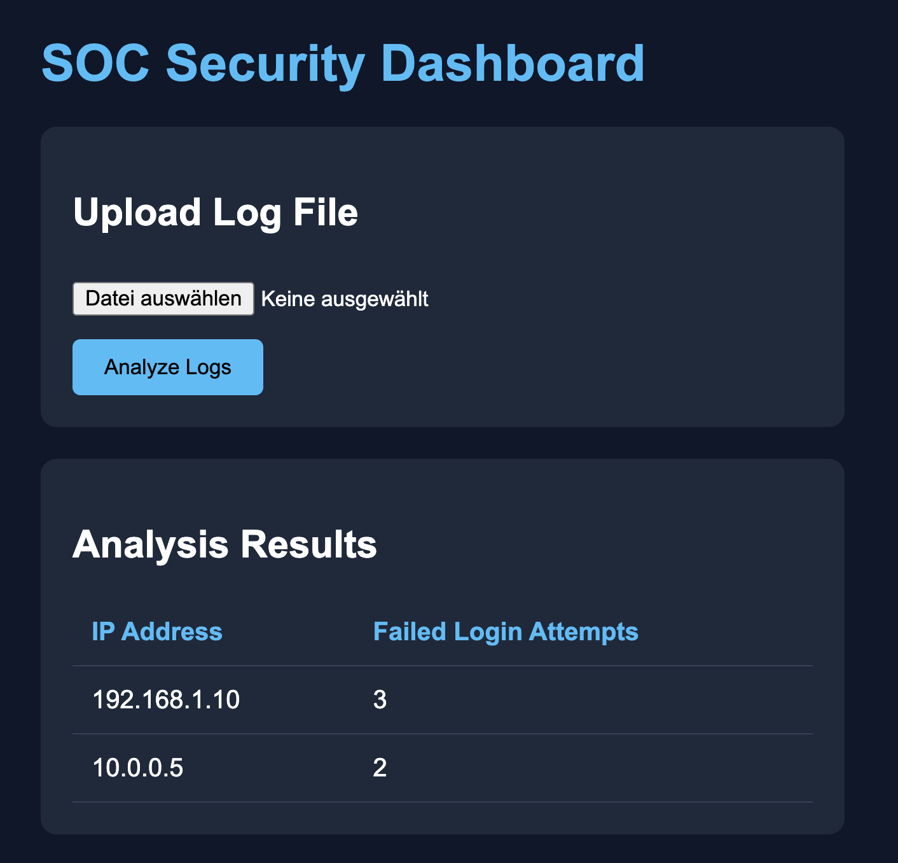

# Django-log-analyzer
A simple Django-based cybersecurity dashboard for analyzing Linux authentication logs and detecting failed SSH login attempts.

## Features

- Upload log files
- Detect failed SSH logins
- Count suspicious IP addresses
- SOC-style dashboard UI
- Regex-based log analysis

## Technologies

- Python
- Django
- HTML/CSS
- Regex

## Example Detection

Failed password attempts are extracted from logs and grouped by IP address.

## Future Improvements

- Severity levels
- Real-time monitoring
- Splunk-style dashboards
- Threat intelligence integration

## Dashboard Preview

